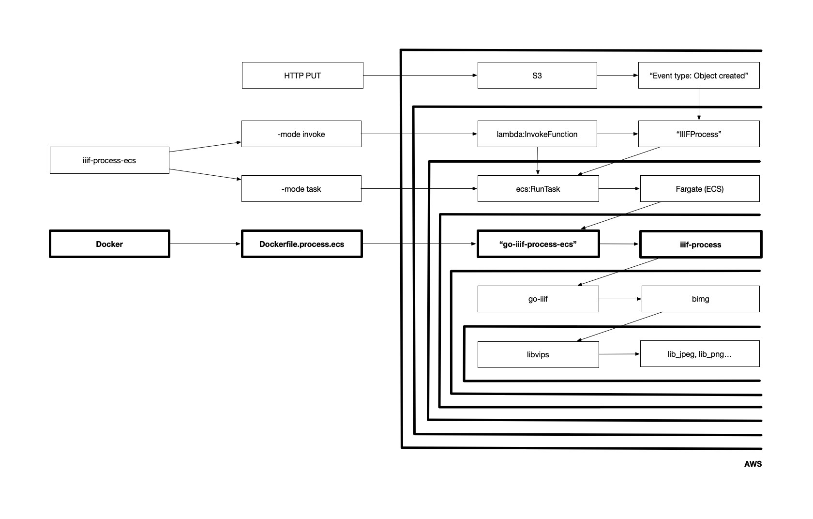
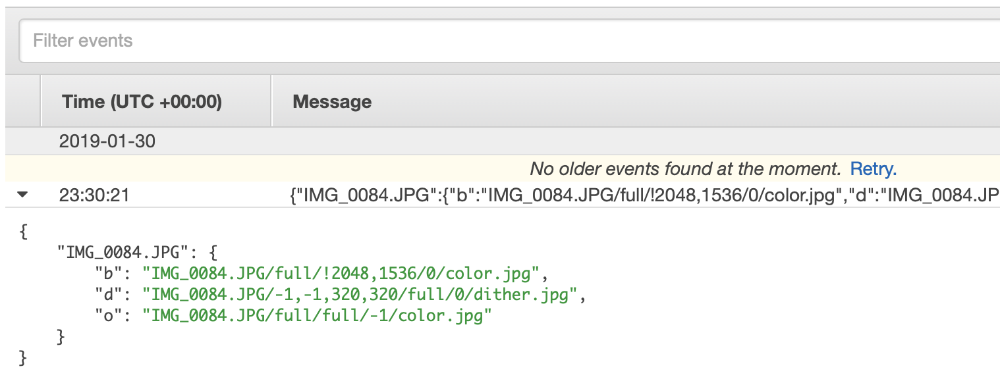

# go-iiif-aws

Go package for using go-iiif in AWS.

## Install

You will need to have both `Go` (specifically a version of Go more recent than 1.7 so let's just assume you need [Go 1.11](https://golang.org/dl/) or higher) and the `make` programs installed on your computer. Assuming you do just type:

```
make bin
```

All of this package's dependencies are bundled with the code in the `vendor` directory.

## Important

If you're reading this it means that the documentation is still being finalized.

## Docker

### go-iiif-process-ecs

Build a Docker container with an up-to-date copy of the [iiif-process](https://github.com/aaronland/go-iiif#iiif-process-1) tool bundled with custom IIIF config and (processing) instructions file. The easiest way to build this container is to use the `docker-process` Makefile target passing the paths to your custom IIIF config and instructions files.

For example:

```
$> make docker-process CONFIG=/usr/local/my-go-iiif-config.json INSTRUCTIONS=/usr/local/my-go-iiif-instructions.json
time passes...

$> docker run go-iiif-process-ecs /bin/iiif-process -h
Usage of /bin/iiif-process:
  -config string
    	Path to a valid go-iiif config file.
  -instructions string
    	Path to a valid go-iiif processing instructions file.
  -report
    	Store a process report (JSON) for each URI in the cache tree.
  -report-name string
    	The filename for process reports. Default is 'process.json' as in '${URI}/process.json'. (default "process.json")
  -uri value
    	One or more valid IIIF URIs.

$> docker run go-iiif-process-ecs ls -al /etc/go-iiif/config.json
-rw-r--r--    1 root     root          1033 Jan 28 20:03 /etc/go-iiif/config.json
```

### ECS

At this point you will need to push the your `go-iiif-process-ecs` container to your AWS ECS repository. The intracasies of setting up ECS are outside the scope of this document but Remy Dewolf's [AWS Fargate: First hands-on experience and review](https://medium.com/@remy.dewolf/aws-fargate-first-hands-on-experience-and-review-1b52fca2148e) is a pretty good introduction.

What follows is a good faith to explain all the steps. I still find setting up ECS services confusing. In the examples that follow everything is called `go-iiif-process-ecs` but you can call things whatever you want.

#### Docker

The first thing you need to do is bake a Docker container that contains your IIIF config and instructions file. The easiest thing is to use the handy `docker-process` Makefile target, specifying the path to your config files. For example:

```
make docker-process CONFIG=/path/to/your/config.json INSTRUCTIONS=/path/to/your/instructions.json
```

This will create a new Docker image called `go-iiif-process-ecs`.

#### Repository

Create a new ECS repository called `go-iiif-process-ecs`

```
docker tag go-iiif-process-ecs:latest {AWS_ACCOUNT_ID}.dkr.ecr.{AWS_REGION}.amazonaws.com/go-iiif-process-ecs:0.0.1
docker push {AWS_ACCOUNT_ID}.dkr.ecr.{AWS_REGION}.amazonaws.com/go-iiif-process-ecs:0.0.1
```

#### Task definitions

Create a new task definition called `go-iiif-process-ecs`.

Your task definition will need a suitable AWS IAM role with the following properties:

* A trust definition with `ecs-tasks.amazonaws.com`

And the following policies assigned to it:

* `AmazonECSTaskExecutionRolePolicy`
* A custom policy with the necessary permissions your task will need to read-from and write-to source and derivative caches (typically S3)

The task should be run in `awsvpc` network mode and require the `FARGATE` capability.

##### Container definition (for your task definition)

Add a container called `go-iiif-process-ecs` and set the image to be`{AWS_ACCOUNT_ID}.dkr.ecr.{AWS_REGION}.amazonaws.com/go-iiif-process-ecs:0.0.1`.

Configure the container limits, and other settings, as necessary. By default you shouldn't need to do anything besides specifying the image.

#### Clusters

Create a "Network only" cluster called `go-iiif-process-ecs`.

There isn't really anything of note when configuring a `iiif-process-ecs` cluster. Services and tasks in this cluster are meant to be invoked atomically so there is no need to configure any persistent or long-running processes.

#### Services

Inside your cluster create a new service called `go-iiif-process-ecs`.

You should ensure the following properties when configuring a `go-iiif-process-ecs` service.

| Property | Value |
| --- | --- |
| Service Type | `REPLICA` |
| Launch Type | `FARGATE` |
| Service Role | `AWSServiceRoleForECS` |
| Auto-assign public IP | `ENABLED` |

The details of subnets and security groups for your `go-iiif-process-ecs` service are left to you but it is important that whatever security group you implement has access to the external internet (`0.0.0.0/0`).

## Tools

### iiif-process-ecs



Command line tool for working with the `go-iiif-process-ecs` -tagged Docker container (see above). 

```
$> ./bin/iiif-process-ecs -h
Usage of ./bin/iiif-process-ecs:
  -cluster string
    	The name of your AWS ECS cluster.
  -config string
    	The path your IIIF config (on/in your container). (default "/etc/go-iiif/config.json")
  -container string
    	The name of your AWS ECS container.
  -ecs-dsn string
    	A valid (go-whosonfirst-aws) ECS DSN.
  -instructions string
    	The path your IIIF processing instructions (on/in your container). (default "/etc/go-iiif/instructions.json")
  -lambda-dsn string
    	A valid (go-whosonfirst-aws) Lambda DSN. Required if -mode is "invoke".
  -lambda-func string
    	A valid Lambda function name. Required if -mode is "invoke".
  -lambda-type string
    	A valid go-aws-sdk lambda.InvocationType string. Required if -mode is "invoke".
  -mode string
    	Valid modes are: lambda (run as a Lambda function), invoke (invoke this Lambda function), task (run this ECS task). (default "task")
  -security-group value
    	One of more AWS security groups your task will assume.
  -strip-paths
    	Strip directory tree from URIs. (default true)
  -subnet value
    	One or more AWS subnets in which your task will run.
  -task string
    	The name of your AWS ECS task (inclusive of its version number),
  -uri value
    	One or more valid IIIF URIs.
  -wait
    	Wait for the task to complete.
```

It can be:

* Used to invoke a `iiif-process` task directly from the command-line, passing in one or more URIs to process.
* Bundled as an AWS Lambda function that can be run to invoke your task.
* Used to invoke that Lambda function (to invoke your task) from the command-line.

#### -mode task

For example, if you just want to run the ECS task from the command-line:

```
$> iiif-process-ecs -mode task \
   -ecs-dsn 'region={AWS_REGION} credentials={AWS_CREDENTIALS}' \
   -subnet {SUBNET} \
   -security-group {AWS_SECURITY_GROUP} \
   -cluster go-iiif-process-ecs -container go-iiif-process-ecs \
   -task go-iiif-process-ecs:1 \
   -uri IMG_0084.JPG
```

Assuming everything is configured properly you should see something like this:

```
2019/01/30 15:30:01 arn:aws:ecs:{AWS_REGION}:{AWS_ACCOUNT_ID}:task/{ECS_TASK_ID}
```

One of the known-knowns about this code base is that it's still clear how or whether its possible to capture the output of a container/task. It's not clear to me that it's possible without a lot of extra code to poll and parse CloudWatch logs. If your task completed successfully you will eventually see something like the following in CloudWatch:



#### -mode invoke

If you've installed this tool as a Lambda function (see below) and then want to _invoke_ that Lambda function from the command-line:

```
$> iiif-process-ecs -mode invoke \
   -lambda-dsn 'region={AWS_REGION} credentials={AWS_CREDENTIALS}' \
   -lambda-func 'ProcessIIIF` \
   -lambda-type 'RequestResponse' \
   -uri avocado.png \
   -uri toast.jpg 
```

### Running `iiif-process-ecs` as a Lambda function

_If you're reading this building Lambda functions is currently broken._

This assumes you've already set up your ECS task, which is outside the scope of this documentation.

First run the handy `lambda-process` target in the Makefile:

```
make lambda-process
```

Then create a new Go Lambda function in AWS and upload the resulting `process-task.zip` file. You will need to set the following environment variables:

| Environment variable | Value |
| --- | --- |
| `IIIF_PROCESS_ECS_DSN` | region=us-east-1 credentials=iam: |
| `IIIF_PROCESS_MODE` | lambda |
| `IIIF_PROCESS_SECURITY_GROUP` | sg-*** |
| `IIIF_PROCESS_SUBNET` | subnet-***,subnet-***,subnet-*** |
| `IIIF_PROCESS_TASK` | iiif-process:2 |

See the `IIIF_PROCESS_MODE=lambda` variable? That's important. Also, see the way we're passing options that can have multiple values (subnets, security groups, etc.) as comma-separated values? Yeah, that.

You'll need to make sure the role associated with your Lambda function has the following policies:

* `AWSLambdaExecute`
* A valid policy for reading from and writing to whatever S3 buckets are defined in your (IIIF) config
* Something like this:

```
{
    "Version": "2012-10-17",
    "Statement": [
        {
            "Sid": "Stmt1",
            "Effect": "Allow",
            "Action": [
                "ecs:RunTask"
            ],
            "Resource": [
                "arn:aws:ecs:us-west-2:{AWS_ACCOUNT_ID}:task-definition/{ECS_TASK}:*"
            ]
        },
        {
            "Sid": "Stmt2",
            "Effect": "Allow",
            "Action": [
                "iam:PassRole"
            ],
            "Resource": [
                "arn:aws:iam::{AWS_ACCOUNT_ID}:role/ecsTaskExecutionRole",
		"arn:aws:iam::{AWS_ACCOUNT_ID}:role/{ECS_TASK_ROLE}"
            ]
        }
    ]
}
```

## go-whosonfirst-aws DSNs

`go-whosonfirst-aws` DSNs are strings with one or more `key=value` pairs separated by a space.

### ecs-dsn

Required keys in a `go-whosonfirst-aws` DSN string for ECS services are:

* `region=AWS_REGION`
* `credentials=CREDENTIALS`

### lambda-dsn

Required keys in a `go-whosonfirst-aws` DSN string for Lambda services are:

* `region=AWS_REGION`
* `credentials=CREDENTIALS`

### credentials

| Value | Description |
| --- | --- |
| `iam:` | Assume that all credentials are handled by AWS IAM roles |
| `env:` | Assume that all credentials are handler by AWS-specific environment variables |
| `PATH:PROFILE` | Assume that all credentials can be found in the `PROFILE` section of the ini-style config file `PATH` |
| `PROFILE` | Assume that all credentials can be found in the `PROFILE` section of default AWS credentials file |

## Known-knowns

* The output of the `iiif-process` itself is not returned when `iiif-process-ecs` is invoked on the command-line. This will be fixed soon, hopefully.
* If you invoke `iiif-process-ecs` with `-mode invoke` (meaning you're invoking a Lambda function which will invoke your ECS task) _and_ pass the `-wait` flag (meaning you want to wait until the ECS process completes) then my experience has been the Lambda function will fail. Specifically the ECS task will complete but Lambda won't be signaled accordingly (by the `ecs.WaitUntilTasksStopped`). I'm not sure what's going on here...

## See also

* https://github.com/aaronland/go-iiif
* https://github.com/awslabs/aws-lambda-container-image-converter/